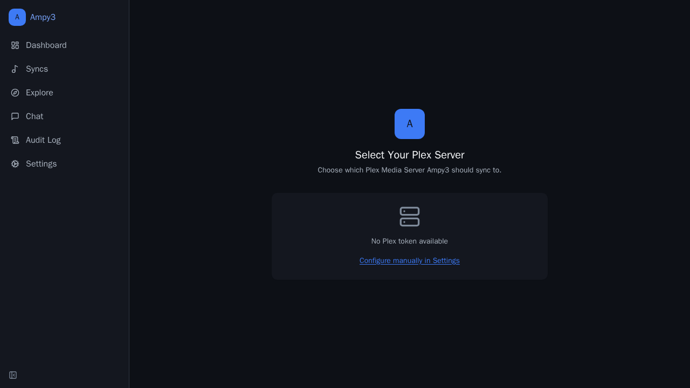
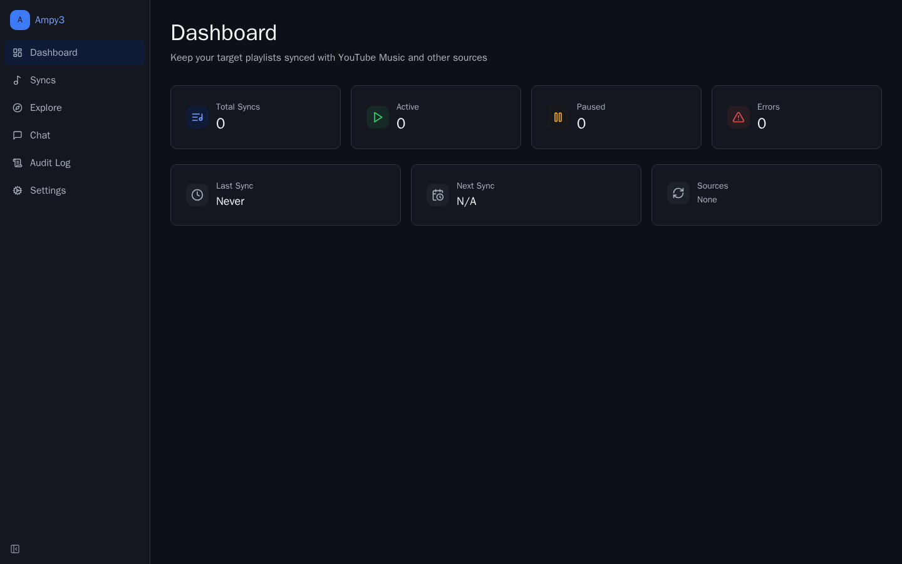
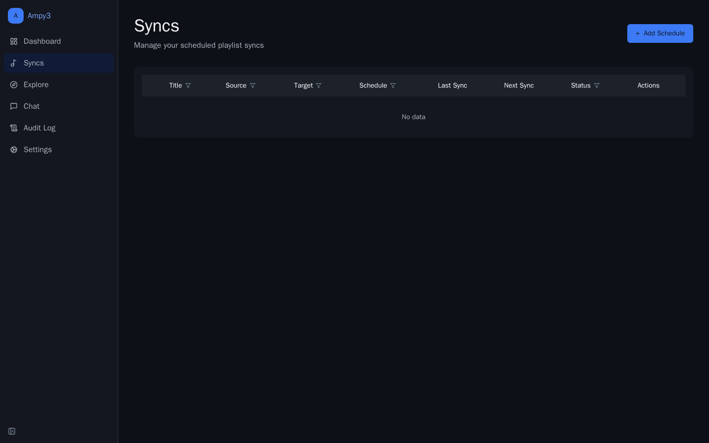
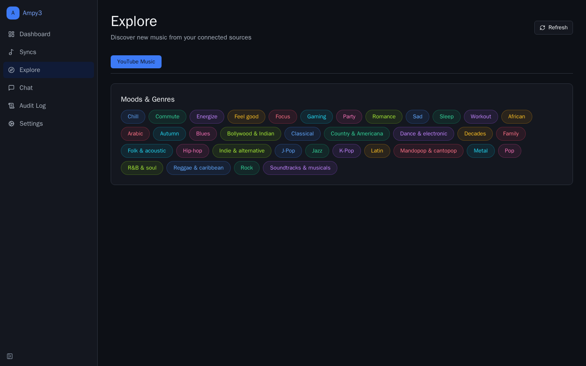
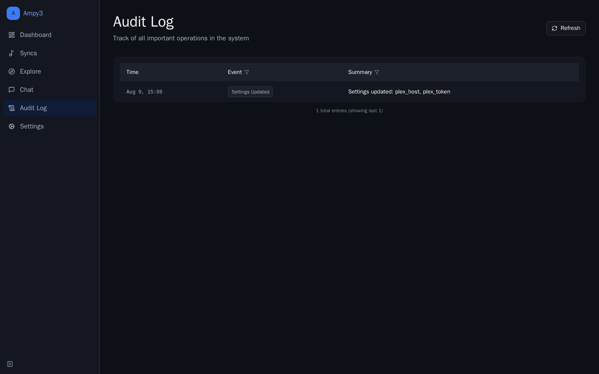
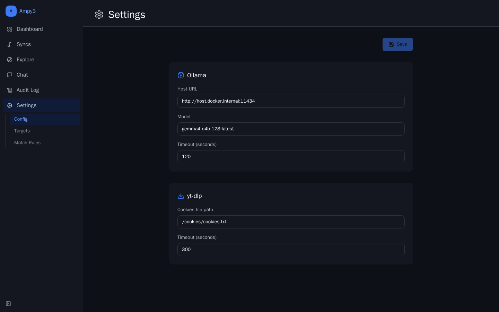
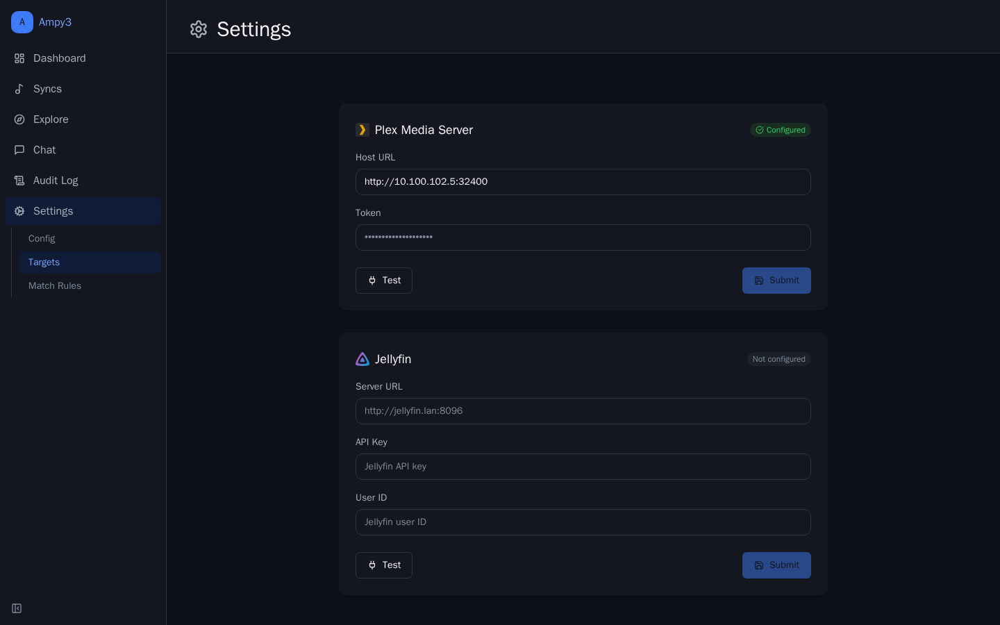
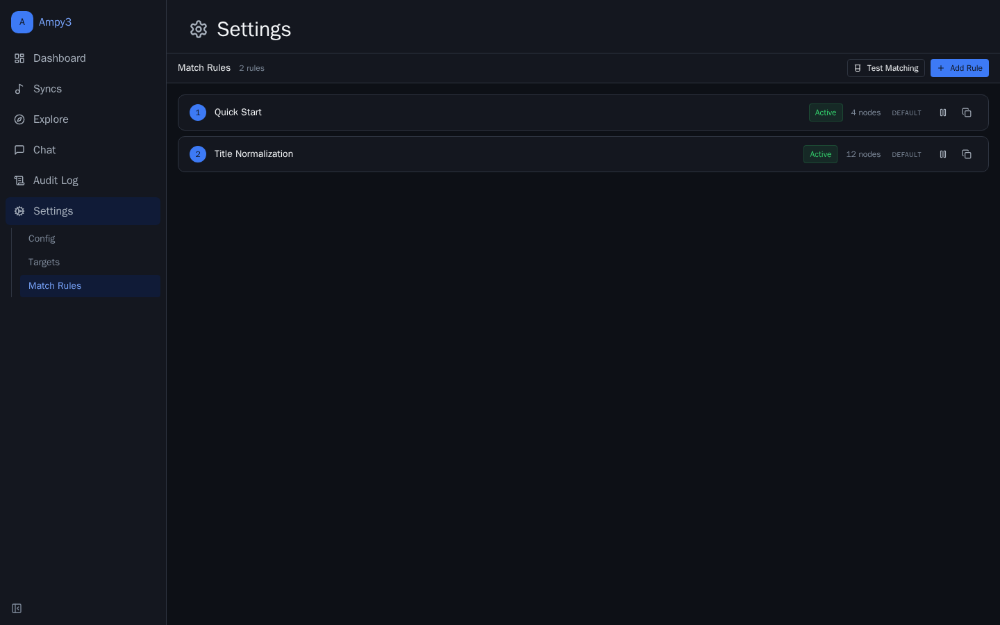

# Ampy3

[](https://github.com/JakePeralta7/Ampy3/actions/workflows/ci.yml)

Syncs YouTube Music playlists to Plex or Jellyfin using MusicBrainz IDs for metadata matching.

## Quick Start

```bash
git clone https://github.com/JakePeralta7/Ampy3 && cd Ampy3
docker compose up --build -d
```

Open `http://localhost:8000` and complete setup/configuration to connect your target server.

## Screenshots


















On first launch Ampy3 walks you through selecting your Plex server. Other pages (Dashboard, Syncs, Explore, Chat, Audit Log, Settings) unlock once a target server is configured.

## Stack

- **Backend:** Python / FastAPI + Celery workers
- **Frontend:** React / TypeScript / Tailwind
- **Infra:** Docker Compose, PostgreSQL, Valkey (Redis)
