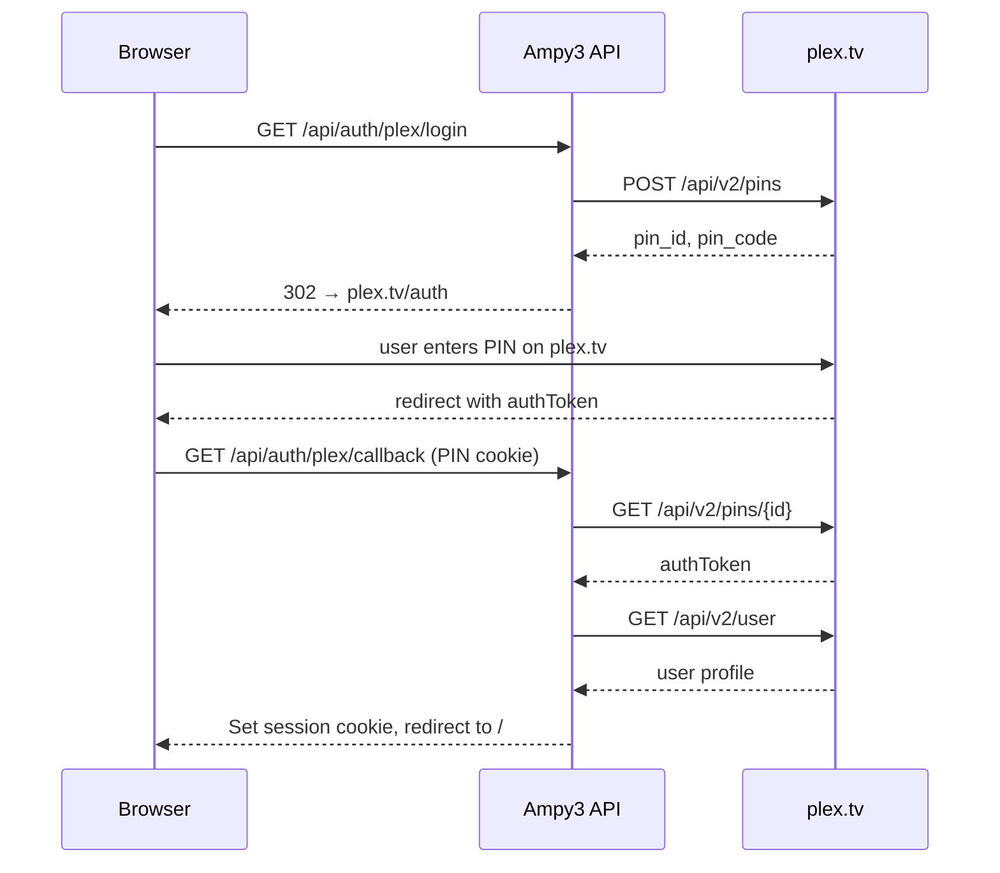

# Auth

By default Ampy3 has **no authentication** — anyone who can reach the host can use it. This is fine for `localhost`, but the moment you expose the API beyond your machine you should turn Plex SSO on.

## Enabling Plex SSO

```bash
REQUIRE_AUTH=true
PLEX_CLIENT_ID=ampy3-instance-1           # any stable string; generated automatically if blank
APP_URL=https://ampy3.example.com
SECRET_KEY=$(openssl rand -hex 32)        # required, see below
SESSION_TTL_HOURS=72                      # default is 168 (1 week)
APP_ENV=production
```

Restart the API for the changes to take effect.

!!! danger "`SECRET_KEY` must be set"
    With `REQUIRE_AUTH=true`, an empty `SECRET_KEY` prevents sessions from being created and you'll be stuck in an infinite login loop. Generate a fresh 32-byte hex string per deployment and never commit it.

## How the flow works

[`app.auth.router`][app.auth.router] implements Plex's PIN-based forwarding flow:



### Single-owner model

The **first** user to log in is registered as the **owner**. Subsequent logins from a different Plex user are rejected (logged to the audit log). This is intentional — Ampy3 is a personal media tool, not a multi-tenant SaaS.

If you need to reset ownership (lost account, etc.):

```bash
docker compose exec postgres psql -U ampy3 ampy3 \
    -c "DELETE FROM config WHERE key IN ('owner_plex_user_id', 'owner_plex_token');"
```

The next login becomes the new owner.

## Sessions

Sessions are stored server-side in the `session` table (created via Alembic). The session cookie is:

- **HttpOnly** — never accessible to JavaScript
- **Secure** — set automatically when `REQUIRE_AUTH=true` or `APP_ENV=production`
- **SameSite=Lax** — cross-origin POSTs from the React UI still work
- **TTL = `SESSION_TTL_HOURS`** — defaults to 1 week

Logout via `POST /api/auth/logout` revokes the session server-side and clears the cookie. See [`destroy_session`][app.auth.tokens.destroy_session].

## CORS

When `REQUIRE_AUTH=true`, only the `APP_URL` origin is allowed by CORS. The React frontend running on the same host works fine; a frontend hosted on a different origin needs its URL added to the allowlist (or proxied through the same host).

When `REQUIRE_AUTH=false`, CORS is `*` — convenient for development, dangerous in production.

## Dependencies

`get_current_user` (`app.auth.dependencies`) is the FastAPI dependency that protects every route. Routes that need authentication declare:

```python
from src.app.auth.dependencies import get_current_user

@router.get("/me")
async def me(user: dict = Depends(get_current_user)): ...
```

If `REQUIRE_AUTH=false`, the dependency is a no-op pass-through that returns a synthetic admin user. This keeps the routes uniform across both modes.

## Where to look next

- [`app.auth`][app.auth] — full auth package
- [`app.auth.router`][app.auth.router] — Plex SSO routes
- [`app.auth.tokens`][app.auth.tokens] — session create/destroy/verify
- [`app.auth.dependencies`][app.auth.dependencies] — `get_current_user`, `SESSION_COOKIE`
- [Configuration](../getting-started/configuration.md#section-auth-plex-sso) — env var reference