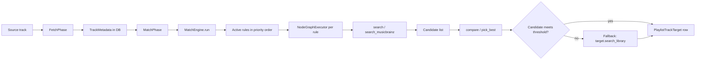

# Metadata matching

Ampy3's default matching strategy is **target-first**: every source track is searched against your Plex or Jellyfin library, scored against the source metadata, and either accepted or rejected. MusicBrainz is an **optional adjunct** node (`search_musicbrainz`) that can be wired into the rule graph when you need MusicBrainz IDs or when the target library is missing the canonical release.

## How a track gets matched



1. **Fetch source track** as [`TrackMetadata`][app.core.models.TrackMetadata] and persist in `playlist_tracks`.
2. **Load active match rules** via [`get_active_rules_sync`][app.core.services.matcher.get_active_rules_sync] — returns **all active rules ordered by priority** (not "the active rule").
3. **Execute the rules** via [`MatchEngine.run(track, rules=...)`][app.core.services.matcher.MatchEngine] — runs each rule's canvas and collects matches.
4. **Accept the best match** that passes the threshold and persists a [`PlaylistTrackTarget`][app.models.PlaylistTrackTarget] row.
5. **Fallback** — if no rule produces a match, [`MatchPhase._fallback_search`][app.worker.phases.MatchPhase] calls `target.search_library(...)` directly with title/artist/album.

## Built-in node types

Run `python -c "from app.core.nodes.registry import get_registered_types; print(get_registered_types())"` for the canonical list as of your checkout. As of this writing:

| Node | Module | Purpose |
|------|--------|---------|
| `track_source` | [`app.core.nodes.io`][app.core.nodes.io] | Emits the current `TrackMetadata` into the graph as a dict. |
| `search` | [`app.core.nodes.search`][app.core.nodes.search] | Searches the **target** (Plex/Jellyfin) library for candidates. |
| `plex_search` | [`app.core.nodes.search`][app.core.nodes.search] | Legacy Plex-specific search with `search_type` config (`title_only`, `artist_tracks`, …). |
| `search_musicbrainz` | [`app.core.nodes.musicbrainz`][app.core.nodes.musicbrainz] | Searches MusicBrainz for the recording; returns the top recording or `None`. |
| `compare` | [`app.core.nodes.matching`][app.core.nodes.matching] | Self-contained match selector: scores candidates against a reference track by weighted field similarity and returns the best candidate above `threshold` (or `None`). |
| `pick_best` | [`app.core.nodes.matching`][app.core.nodes.matching] | Selects the highest-scoring candidate above a `title_threshold`. |
| `sort_by_score` | [`app.core.nodes.matching`][app.core.nodes.matching] | Sorts a candidate list by title similarity. |
| `filter` | [`app.core.nodes.similarity`][app.core.nodes.similarity] | Drops candidates that don't match a similarity predicate. |
| `threshold` | [`app.core.nodes.similarity`][app.core.nodes.similarity] | Numeric threshold gate. |
| `similarity` | [`app.core.nodes.similarity`][app.core.nodes.similarity] | Numeric distance/similarity between two strings. |
| `transform` | [`app.core.nodes.transform`][app.core.nodes.transform] | Mutates a candidate's metadata. |
| `logic_op` | [`app.core.nodes.logic`][app.core.nodes.logic] | Boolean combinators (`and`, `or`, `not`, `if_else`). |
| `constant` | [`app.core.nodes.io`][app.core.nodes.io] | Emits a constant `value` from config. |
| `match_output` | [`app.core.nodes.io`][app.core.nodes.io] | Terminal node — emits the chosen candidate. |

!!! note "`compare` is a self-contained matcher"
    The default "Quick Start" rule uses `compare`, not `pick_best`. `compare` already combines scoring + filtering + best-selection internally — you don't need to chain `pick_best` after it.

## Match-rule YAML

Rules live in the `MatchRule` table and are edited from **Settings → Match rules**. A rule is a small DAG:

```yaml
name: "Quick Start"
description: >
  Simple search-then-compare pipeline. Searches Plex by title, artist and album,
  then scores candidates with a 0.75 weighted threshold. A good first rule that
  covers the majority of well-tagged tracks.
nodes:
  source:
    type: track_source
  search:
    type: search
    config:
      fields_to_search:
        - search_title
        - search_artist
        - search_album
      max_results: 50
  compare:
    type: compare
    config:
      fields_to_match:
        - title
        - artist_name
        - album_name
      threshold: 0.75
      weights:
        title: 50
        artist_name: 25
        album_name: 25
  output:
    type: match_output
edges:
  - from: source
    to: search
  - from: search
    to: compare
    source_handle: out
    target_handle: candidates
  - from: compare
    to: output
```

This exact YAML is shipped as [`01-quick-start.yaml`](https://github.com/JakePeralta7/Ampy3/blob/main/src/app/match_rules/defaults/01-quick-start.yaml) and seeded on startup. A second rule, [`02-title-normalization.yaml`](https://github.com/JakePeralta7/Ampy3/blob/main/src/app/match_rules/defaults/02-title-normalization.yaml), adds title cleanup.

Notes on the YAML schema:

- **Node keys are semantic** — choose any name (`search`, `pick_best`, …) you like.
- **Positions are not stored** — [`auto_layout`][app.match_rules.layout.auto_layout] computes coordinates when the rule is rendered.
- **Validation is strict** — see [`RuleDefinition`][app.match_rules.schema.RuleDefinition] for the full Pydantic schema (edge endpoints must reference declared nodes, names max 100 chars).

## Active rule selection

**All rules with `is_active = true` participate**, in `priority` order. There is no "only one active rule" concept.

- [`MatchPhase._match_with_rules`][app.worker.phases.MatchPhase] calls [`get_active_rules_sync()`][app.core.services.matcher.get_active_rules_sync] (sync version for Celery), which returns `SELECT * FROM match_rules WHERE is_active ORDER BY priority`.
- [`MatchEngine.run`][app.core.services.matcher.MatchEngine] iterates them in order; the first rule that produces a match wins.
- Toggle a rule on/off or reorder via `PUT /api/v1/match-rules/reorder` (see [Reference → API](../reference/api.md)).

## Match outcome schema

What `MatchPhase` writes to the database — fields are on [`MatchResult`][app.worker.context.MatchResult] (in-memory) and persisted to [`PlaylistTrackTarget`][app.models.PlaylistTrackTarget] (DB):

| Field | Source | Meaning |
|-------|--------|---------|
| `matched` | `MatchResult` | `True` if a target item was found. |
| `message` | `MatchResult` | Human-readable explanation ("Matched '…' to '…'" / "No match for '…'"). |
| `item_id` | both | Plex/Jellyfin rating key. `None` if unmatched. |
| `title` / `artist_name` / `album_name` | both | The matched target track's metadata. |
| `duration` | DB | Track length in seconds. |
| `rule_id` | both | Which rule produced the match. `None` for the `_fallback_search` path. |
| `_rule_id` / `_rule_name` / `_rule_priority` | `MatchEngine.run` return | Per-rule diagnostic metadata; persisted by `MatchPhase` into `PlaylistTrackTarget.rule_id`. |

A match is considered "unmatched" when **no rule** produces a candidate above its `threshold` **and** the direct `target.search_library(...)` fallback also returns nothing. The most common cause is that the target library doesn't contain a sufficiently close release — not "MusicBrainz is broken".

## Tuning matching

The default "Quick Start" rule is a good starting point. Common adjustments:

- **Lower `threshold`** (e.g. `0.6`) — more matches, more false positives.
- **Higher `threshold`** (e.g. `0.9`) — fewer matches, more `unmatched` rows.

!!! warning "Be careful with low thresholds"
    A threshold below ~0.5 will start matching tracks with similar titles but different artists/albums ("Best of You" vs "Best of Me"). Always verify in the **Audit log** after changing `threshold`.

- **Add a `filter` node** to drop remixes / live versions / karaoke takes before `compare`.
- **Increase `max_results`** in `search` if your library has many regional releases.
- **Insert `search_musicbrainz`** between `search` and `compare` if you need MB-recorded lookups; the recording's `id` flows downstream.

After every change, run an affected sync and re-check the **Audit log**.

## Where to look next

- [`app.core.services.matcher`][app.core.services.matcher] — `NodeGraphExecutor`, `MatchEngine`, `get_active_rules_sync`
- [`app.core.matching`][app.core.matching] — pure scoring helpers (`_best_match`, `_match_titles`, `_artist_similarity`, `_normalize_album`)
- [`app.match_rules`][app.match_rules] — schema, parser, validator, loader, layout
- [`app.core.nodes`][app.core.nodes] — all built-in node handlers
- [Sync pipeline](sync-pipeline.md) — where matching fits in the larger flow