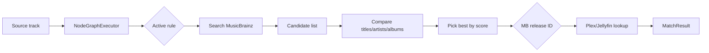

# Metadata matching

The whole point of Ampy3 is **MusicBrainz-first matching**. Every track that comes out of a source is run through a rule graph that searches MusicBrainz, scores candidates, and emits the best match — usually the canonical release that already lives in your Plex/Jellyfin library.

## How a track gets matched



1. **Fetch source track** ([`TrackMetadata`][app.core.models.TrackMetadata])
2. **Load active match rule** — a YAML-defined DAG (`app.match_rules.schema.RuleDefinition`)
3. **Execute the graph** via [`NodeGraphExecutor`][app.core.services.matcher.NodeGraphExecutor]
4. **Emit a match** with a MusicBrainz release ID and confidence score
5. **Look up that release** in Plex/Jellyfin to get the actual library item

## Match-rule YAML

Rules live in the `MatchRule` table and are edited from **Settings → Match rules**. A rule is a small DAG:

```yaml
name: "Quick Start"
description: "Simple search and compare"
nodes:
  source:
    type: track_source
  search:
    type: search
    config:
      fields_to_search: [title, artist, album]
      max_results: 50
  compare:
    type: compare
    config:
      fields_to_match: [title, artist_name, album_name]
      threshold: 0.75
      weights: {title: 50, artist_name: 25, album_name: 25}
  output:
    type: match_output
edges:
  - from: source
    to: search
  - from: search
    to: compare
    source_handle: out
    target_handle: candidates
  - from: compare
    to: output
```

- **Node keys are semantic** — choose any name (`search`, `pick_best`, …) you like.
- **Positions are not stored** — [`auto_layout`][app.match_rules.layout.auto_layout] computes coordinates when the rule is rendered.
- **Validation is strict** — see [`RuleDefinition`][app.match_rules.schema.RuleDefinition] for the full Pydantic schema.

## Built-in node types

| Node | Purpose |
|------|---------|
| `track_source` | Emits the current `TrackMetadata` into the graph. |
| `search` | Looks up MusicBrainz candidates for the track. [`SearchNode`][app.core.nodes.search] |
| `compare` | Scores candidates against the source track. |
| `pick_best` | Selects the highest-scoring candidate above threshold. [`PickBestNode`][app.core.nodes.matching] |
| `sort_by_score` | Sorts candidates by score for downstream selection. |
| `filter` | Drops candidates that don't match a predicate. |
| `transform` | Mutates a candidate's metadata. [`TransformNode`][app.core.nodes.transform] |
| `logic` | AND/OR/NOT combinators over booleans. [`LogicNode`][app.core.nodes.logic] |
| `similarity` | Numeric distance/similarity between two strings. [`SimilarityNode`][app.core.nodes.similarity] |
| `match_output` | Terminal node — emits the chosen candidate. |
| `read` / `write` | I/O for track data. [`IONodes`][app.core.nodes.io] |

Run `python -c "from app.core.nodes.registry import get_registered_types; print(get_registered_types())"` to see the full list as of your checkout.

## Active rule selection

Only one rule is **active** at a time. `MatchPhase` calls [`get_active_rules_sync`][app.core.services.matcher.get_active_rules_sync] to load it. Toggle the active rule from the UI or via the `match_rules` API.

## Match result schema

A match has:

| Field | Meaning |
|-------|---------|
| `musicbrainz_release_id` | Canonical MB release. Empty if no match. |
| `musicbrainz_recording_id` | Canonical MB recording. |
| `score` | Confidence in `[0, 1]`. |
| `matched_target_id` | Plex/Jellyfin item rating key (set after target lookup). |
| `status` | `matched` / `unmatched` / `error` / `skipped`. |
| `reason` | Short human-readable explanation. |

## Tuning matching

The default rule ("Quick Start") is a good starting point. Common adjustments:

- **Lower `threshold`** (e.g. `0.6`) — more matches, more false positives.
- **Higher `threshold`** (e.g. `0.9`) — fewer matches, more `unmatched` rows.
- **Add `filter` nodes** to drop remixes / live versions / karaoke takes.
- **Increase `max_results`** in `search` if your library has many regional releases.

After every change, run an affected sync and re-check the **Audit log**.

## Where to look next

- [`app.core.services.matcher`][app.core.services.matcher] — `NodeGraphExecutor`, `MatchEngine`
- [`app.core.matching`][app.core.matching] — pure scoring helpers (`_best_match`, `_match_titles`, `_artist_similarity`, `_normalize_album`)
- [`app.match_rules`][app.match_rules] — schema, parser, validator, loader, layout
- [`app.core.nodes`][app.core.nodes] — all built-in node handlers