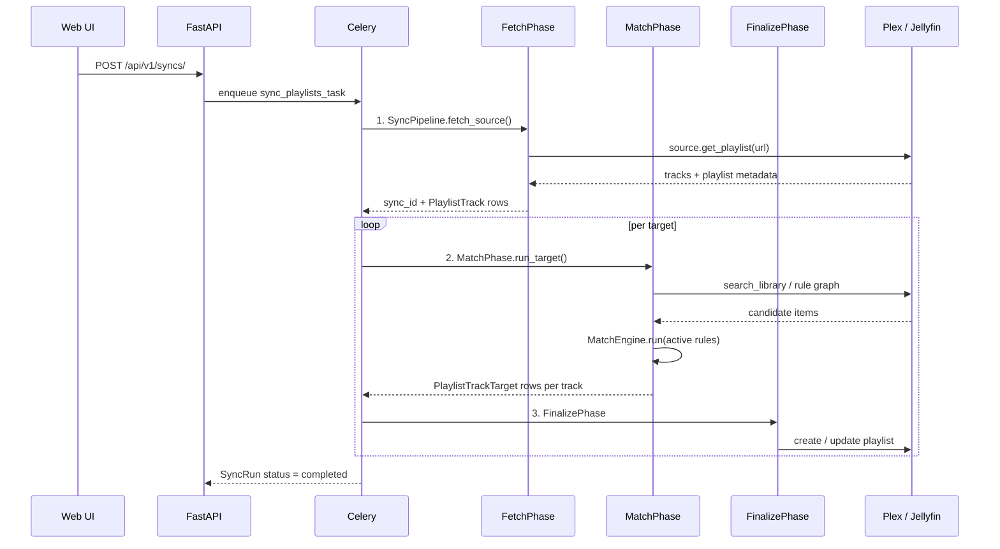

# Sync pipeline

When you click **Run now** (or when the scheduler fires), Ampy3 runs a Celery task that drives a [`SyncPipeline`][app.worker.pipeline.SyncPipeline]. The pipeline composes [`SyncPhase`][app.worker.phases.SyncPhase] instances — each phase handles one stage of the work, and phases are pluggable.

## High-level flow

## Phase 1: FetchPhase

**Lives in:** [`app.worker.phases.FetchPhase`][app.worker.phases.FetchPhase]

- Pulls the source playlist through the appropriate [`IPlatformSource`][app.core.models.IPlatformSource] (YouTube Music, Deezer, …)
- Persists every track to the `playlist_tracks` table (de-duplicated on source + external ID)
- **Runs once per sync invocation**, shared across all configured targets

The phase takes `source_url`, `source`, optional `schedule_id`, and `target_ids` in its input data dict.

## Phase 2: MatchPhase

**Lives in:** [`app.worker.phases.MatchPhase`][app.worker.phases.MatchPhase]

- Loads **all active match rules** in priority order via [`get_active_rules_sync`][app.core.services.matcher.get_active_rules_sync]
- For each rule, runs [`MatchEngine.run(track, rules=...)`][app.core.services.matcher.MatchEngine] which executes the rule's node graph against the target library
- Persists a [`PlaylistTrackTarget`][app.models.PlaylistTrackTarget] row per matched track with the resulting `MatchResult` data
- **Falls back** to a direct `target.search_library(...)` call if no rule produces a match (see [`MatchPhase._fallback_search`][app.worker.phases.MatchPhase])
- **Runs once per target**

See [Metadata matching](metadata-matching.md) for how rules work, the available node types, and tuning tips.

## Phase 3: FinalizePhase

**Lives in:** [`app.worker.phases.FinalizePhase`][app.worker.phases.FinalizePhase]

- Finalises match counts on the `SyncRun` row
- Snapshots per-track outcomes to `sync_run_tracks` + `sync_run_track_targets` (history)
- Updates `ScheduledPlaylistSync` stats and computes `next_sync_at`
- Calls `PlaylistSync.sync(...)` to create/update the playlist on the target
- **Runs once per target**

## `SyncContext`

[`SyncContext`][app.worker.context.SyncContext] is the per-run bag of state passed between phases: `sync_id`, `target_id`, the source URL, the matched tracks, and so on. It's constructed once per target and reused across phases.

## Phase composition

`SyncPipeline` accepts a custom `phases` list — by default `[MatchPhase(), FinalizePhase()]` (Fetch is called separately via `SyncPipeline.fetch_source()`). This makes it easy to:

- Add a **`ReMatchPhase`** for "re-evaluate only" runs that don't re-fetch.
- Add a **`DryRunPhase`** that stops after matching, so you can preview what *would* happen.
- Swap the order — e.g. `[FinalizePhase(), MatchPhase()]` for "force-write without re-matching".

See [`SyncPipeline`][app.worker.pipeline.SyncPipeline] for the composition API.

## Error handling

Each phase returns a [`PhaseResult`][app.worker.phases.PhaseResult] with `success`, `data`, and `error` fields. A failing phase short-circuits the pipeline and marks the `SyncRun` as failed; partial work is rolled back where possible.

Per-track failures do **not** fail the whole sync — they're recorded against the `PlaylistTrackTarget` row and surfaced in the [audit log](../operations/monitoring.md).

## Where to look next

- [`app.worker.pipeline`][app.worker.pipeline] — pipeline orchestration
- [`app.worker.phases`][app.worker.phases] — phase ABC + concrete phases
- [`app.worker.matcher`][app.worker.matcher] — legacy single-target matcher (still used by some Explore workflows)
- [Metadata matching](metadata-matching.md) — the rule graph that `MatchPhase` runs