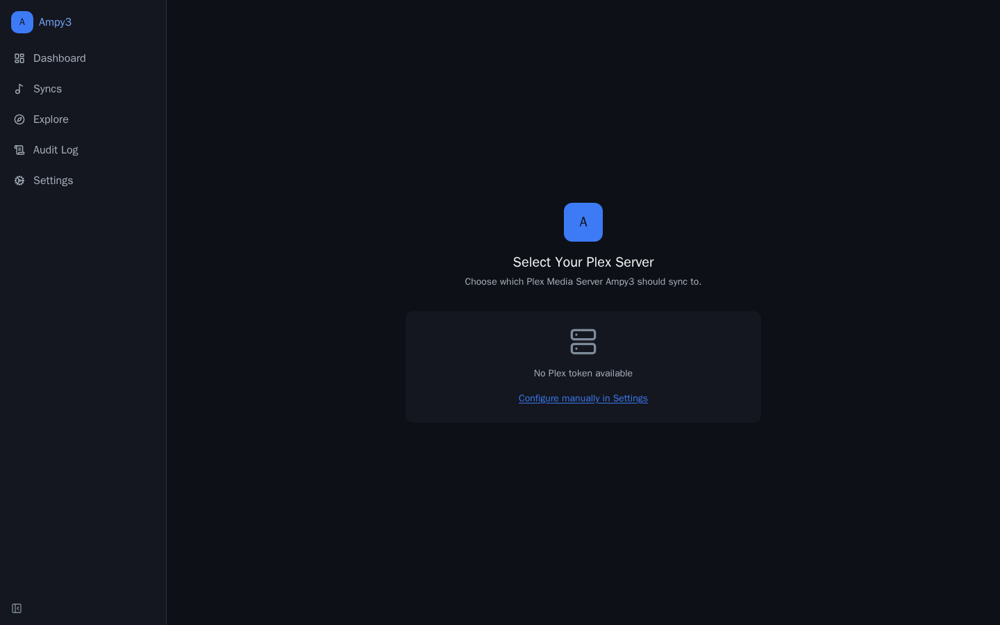
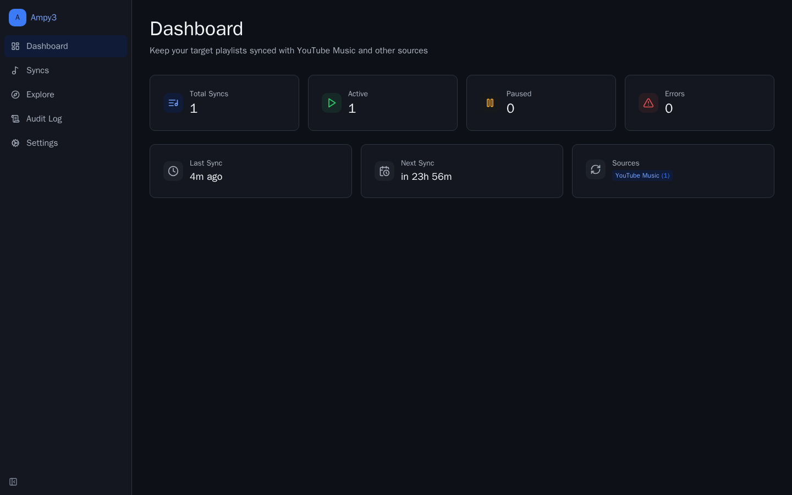
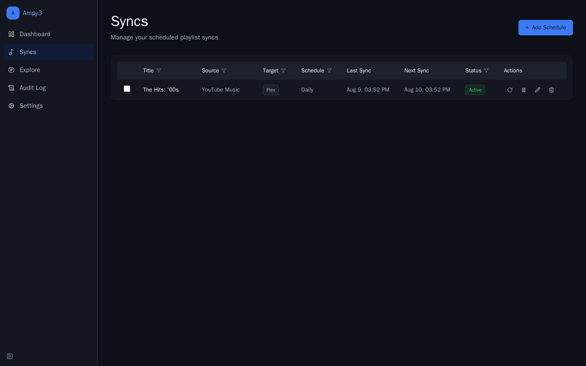
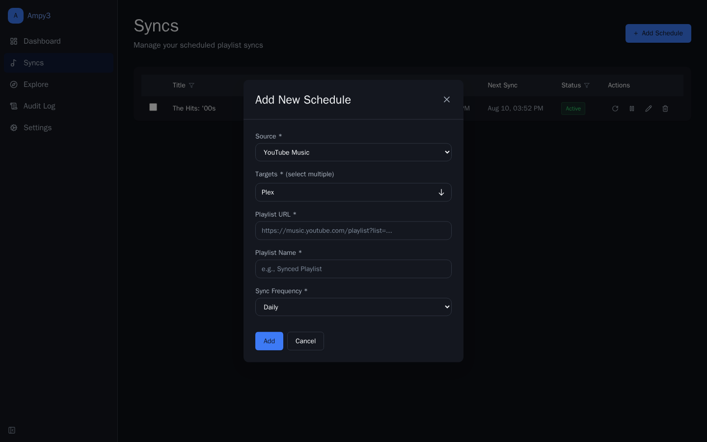
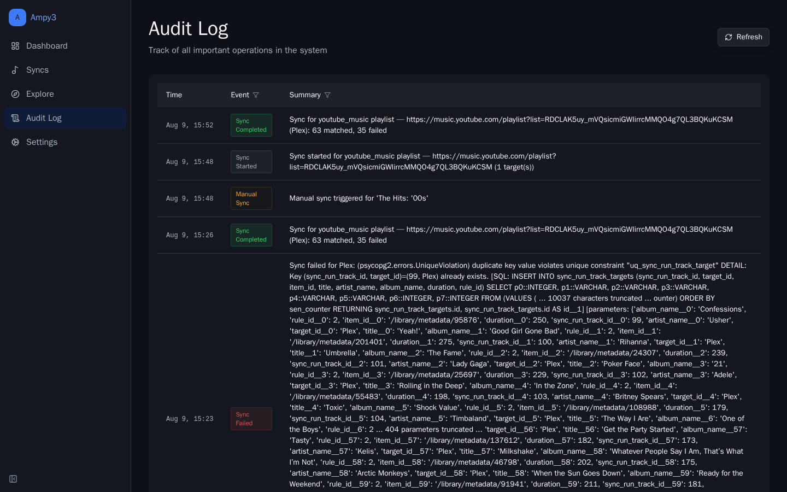
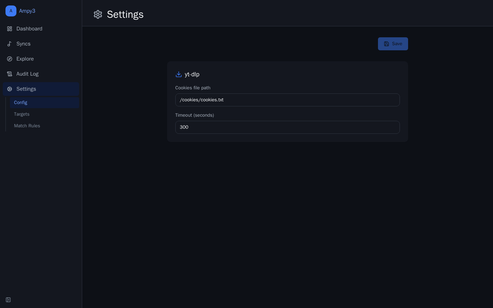
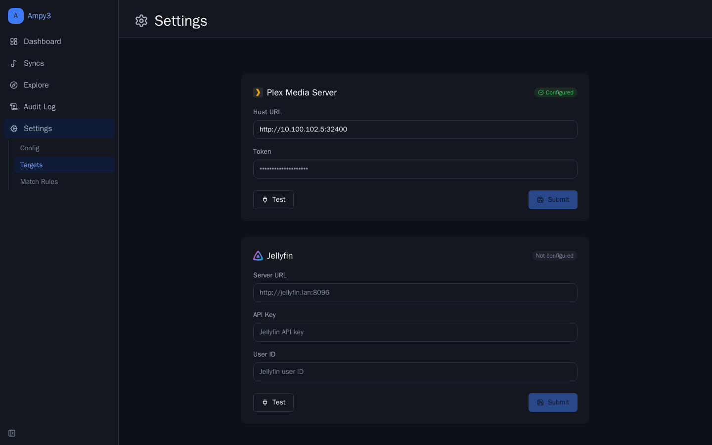

---
hide:
  - navigation
  - toc
---

# Ampy3

**Sync YouTube Music playlists to Plex or Jellyfin — matched by MusicBrainz IDs.**

Ampy3 turns YouTube Music playlists into first-class playlists in your self-hosted media server. It resolves every track through MusicBrainz so you get the right album, the right artist, and the right release on the Plex/Jellyfin side — no more "Topic - Topic (153 Remastered Versions)" clutter.

-   :material-rocket-launch:{ .lg .middle } **Quick start**

    ---

    Up and running in one `docker compose` command — see [Installation](getting-started/installation.md).

    [:octicons-arrow-right-24: Install now](getting-started/installation.md)

-   :material-tune:{ .lg .middle } **Configuration**

    ---

    Every env var Ampy3 reads, with defaults and descriptions — see [Configuration](getting-started/configuration.md).

    [:octicons-arrow-right-24: Configure](getting-started/configuration.md)

-   :material-book-open-page-variant:{ .lg .middle } **Guides**

    ---

    How the sync pipeline, MusicBrainz matching, and the Explore DAG actually work.

    [:octicons-arrow-right-24: Read the guides](guides/sync-pipeline.md)

-   :material-api:{ .lg .middle } **API reference**

    ---

    Auto-generated from Python docstrings across `app.api`, `app.services`, `app.worker`, and more.

    [:octicons-arrow-right-24: Browse the API](reference/api.md)

## Why Ampy3?

!!! info "Metadata-first, not URL-first"
    Most sync tools copy YouTube URLs verbatim and end up with messy libraries. Ampy3 looks every track up on MusicBrainz and adds the canonical release to Plex/Jellyfin — so you get accurate tags, artwork, and gapless playback.

- **Plug-and-play Docker stack** — `postgres`, `valkey`, API, Celery worker, and the web UI in one `docker compose up`.
- **Configurable match rules** — tune confidence thresholds and fuzzy-match behaviour from the UI.
- **Auditable runs** — every sync writes a per-track outcome to the audit log.
- **Explore workflows** — build arbitrary DAGs of fetch → match → transform → write nodes, not just "one playlist = one sync".

## Screenshots

On first launch Ampy3 walks you through selecting your Plex or Jellyfin server. Other pages (Dashboard, Syncs, Explore, Audit Log, Settings) unlock once a target server is configured.

## Stack

| Layer    | Tech                                                          |
|----------|---------------------------------------------------------------|
| Backend  | Python / FastAPI + Celery workers                            |
| Frontend | React / TypeScript / Tailwind (Vite)                          |
| Infra    | Docker Compose, PostgreSQL 16, Valkey (Redis-compatible)     |
| Matching | MusicBrainz (via `musicbrainzngs` + yt-dlp), Plex/Jellyfin APIs |

## Next steps

-   :material-download:{ .lg .middle } **Install**

    ---

    [getting-started/installation.md](getting-started/installation.md)

-   :material-flag-checkered:{ .lg .middle } **First sync**

    ---

    [getting-started/first-sync.md](getting-started/first-sync.md)

-   :material-cog-outline:{ .lg .middle } **Architecture**

    ---

    [development/architecture.md](development/architecture.md)

