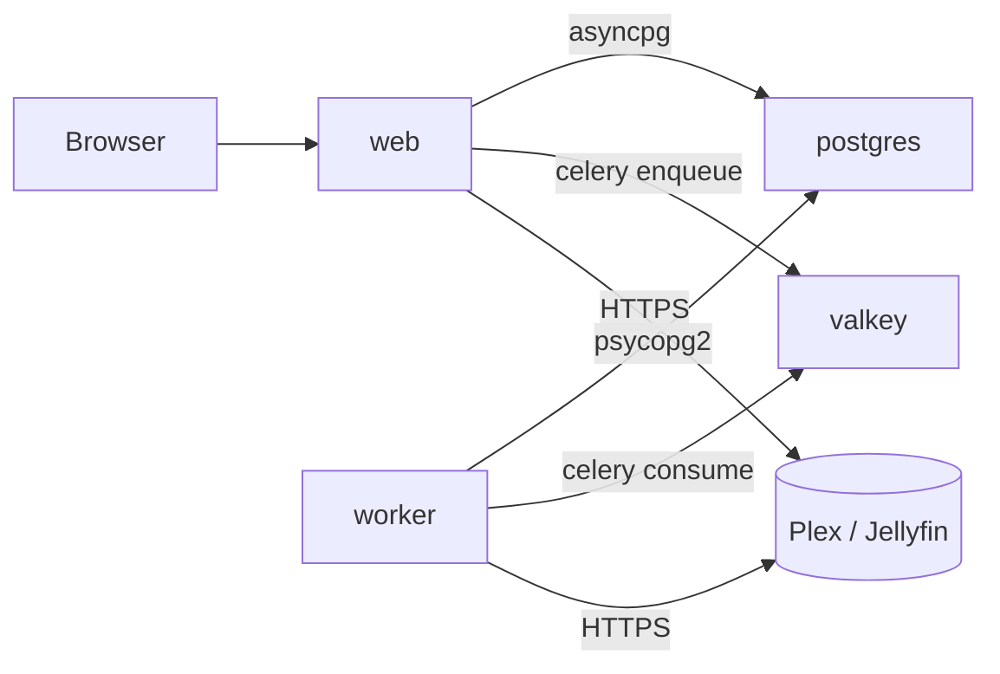

# Docker operations

The Compose stack at [`docker-compose.yml`](https://github.com/JakePeralta7/Ampy3/blob/main/docker-compose.yml) is the production deployment. This page documents the topology, healthchecks, and operational gotchas.

## Service topology



| Service | Image | Role |
|---------|-------|------|
| `web` | Built from local Dockerfile (`web` target) | FastAPI + Uvicorn + Celery beat (for scheduler) |
| `worker` | Built from local Dockerfile (`worker` target) | Celery worker that runs sync tasks |
| `postgres` | `postgres:16-alpine` | Async + sync DB engine |
| `valkey` | `valkey/valkey:7.2-alpine` | Celery broker + result backend |

## Healthchecks

Every service has a healthcheck:

- **`postgres`**: `pg_isready -U ampy3` every 10s
- **`valkey`**: `redis-cli ping` every 10s
- **`web`**: `curl -f http://localhost:8000/health` every 30s with a 15s start period
- **`worker`** does not have a Docker-level healthcheck — monitor via Celery logs or the `/api/celery/...` inspection endpoints instead

`web` and `worker` both wait for `postgres` and `valkey` to be `service_healthy` before starting.

## Volumes

| Volume | Service | Purpose |
|--------|---------|---------|
| `postgres_data` | `postgres` | Postgres data dir — **back this up** |
| `valkey_data` | `valkey` | Valkey persistence (RDB snapshots every 60s + AOF everysec) |
| `./cookies` (bind mount) | `web`, `worker` | Read-only mount of `cookies/cookies.txt` for `yt-dlp` |

!!! danger "The `cookies/` directory must exist"
    Docker refuses to mount a non-existent directory as a volume. Recreate it (even empty) before `docker compose up`, or the stack fails to start with a cryptic error.

## Common commands

```bash
# Bring the stack up
docker compose up --build -d

# Tail logs from a single service
docker compose logs -f web
docker compose logs -f worker

# Restart a single service (e.g. after editing env vars)
docker compose up -d --no-deps web

# Run a one-off command inside a service
docker compose exec web python migrate.py status
docker compose exec postgres psql -U ampy3 ampy3

# Open a Celery shell to inspect queue depth
docker compose exec worker celery -A app.worker.app inspect ping

# Drop the DB (DESTRUCTIVE — drops all syncs, match rules, audit log, sessions)
docker compose down -v
```

## Environment overrides

The Compose file reads from the shell environment so you can override per-launch without editing files:

```bash
APP_PORT=9000 \
REQUIRE_AUTH=true \
APP_URL=https://ampy3.example.com \
SECRET_KEY=$(openssl rand -hex 32) \
    docker compose up --build -d
```

See [Configuration](../getting-started/configuration.md) for the full env-var reference.

## Updating

```bash
git pull
docker compose pull                # pull base images (postgres, valkey)
docker compose up --build -d       # rebuild web/worker if code changed
```

Migrations run automatically at API startup via `init_db()` in `src/app/db.py`. If a migration fails, the API exits non‑zero and `docker compose ps` will show `web` as unhealthy — check `docker compose logs web`.

## Networking

The `web` and `worker` containers reach each other over the default Compose network. The browser reaches `web` over the host port (`APP_PORT`, default 8000). Plex/Jellyfin can be on the same host (use `host.docker.internal` on macOS/Windows, or `--network host` on Linux) or a different machine.

## Resource limits

None are set by default — if you run into OOMs, add `deploy.resources.limits.memory` to each service in `docker-compose.yml`. The worker is the most likely candidate (MusicBrainz + yt-dlp can spike on large playlists).

## Where to look next

- [Monitoring](monitoring.md) — where to look when something goes wrong
- [Backup & restore](backup-restore.md) — protecting your data
- [`docker-compose.yml`](https://github.com/JakePeralta7/Ampy3/blob/main/docker-compose.yml) — source of truth